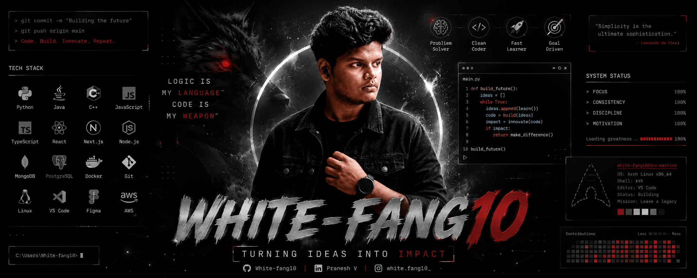

<div align="center">

<!-- Glow stripe top -->


<!-- Banner -->


<!-- Glow stripe bottom -->


<br/>

<!-- Typing SVG -->


<br/>

<!-- Badges -->

&nbsp;

&nbsp;


<br/><br/>

<a href="https://pranesh-portfolio-psi.vercel.app/">
  
</a>
&nbsp;
<a href="https://linkedin.com/in/pranesh-v-0451b0314">
  
</a>
&nbsp;
<a href="mailto:esppranesh@gmail.com">
  
</a>
&nbsp;
<a href="https://leetcode.com/u/praneshvenkidusamy/">
  
</a>

</div>

<br/>

---

## 👨‍💻 &nbsp;`$ whoami`

```python
class PraneshV:
    def __init__(self):
        self.name     = "Pranesh V"
        self.alias    = "White-fang10"
        self.location = "Karur, Tamil Nadu, India"
        self.degree   = "B.Tech — Information Technology"
        self.college  = "V.S.B Engineering College (2023–2027)"
        self.cgpa     = 7.6

        self.stack = [
            "Python", "Java", "JavaScript",
            "React.js", "Node.js", "Express.js",
            "OpenCV", "LLM / RAG", "ESP32"
        ]

        self.fun_fact = (
            "Filed 2 patents before finishing my degree."
        )

    def motto(self) -> str:
        return "Build. Break. Learn. Repeat."

me = PraneshV()
print(me.motto())
# >> Build. Break. Learn. Repeat.
```

---

## 🛠️ &nbsp;Tech Stack

**Languages**


**Frameworks & Web**


**AI / ML & Computer Vision**


**Embedded & Tools**


---

## 🚀 &nbsp;Featured Projects

<table>
<tr>
<td width="50%" valign="top">

### 🦅 Hawk AI &nbsp;`// patented`
> **Deep Learning · OpenCV · CNN · Python**

Automated attendance system powered by facial recognition — operates exclusively through existing smart board cameras, requiring **zero additional hardware**. Real-time face detection under varied lighting, integrated with institutional databases to eliminate manual roll calls entirely.

</td>
<td width="50%" valign="top">

### ⚡ Project Shield &nbsp;`// IoT`
> **ESP32 · ML · LoRa · GSM · Cloud**

Intelligent disaster management platform detecting LT electrical line failures using IoT sensors + ML anomaly detection. Cloud-hosted real-time dashboard with automated GSM/LoRa alerts and **remote circuit isolation** — built for rural grid safety.

</td>
</tr>
<tr>
<td width="50%" valign="top">

### 🧠 ClarifAI &nbsp;`// RAG`
> **RAG · Vector DB (Endee) · LLM · Python · Full Stack**

Production-ready RAG assistant for hackathons and conferences. Semantic search over event documents with **full source attribution** — hallucination-free answers. Coordinator upload portal + participant query interface, all in one platform.

</td>
<td width="50%" valign="top">

### 🏰 House &nbsp;`// competitive coding`
> **React · Node.js · WebSockets · Judge0 API**

Harry Potter–themed online competitive coding arena. Real-time multi-language code execution, live leaderboards, contest timers, difficulty tiers, and a fully animated lore-driven UI — because competitive coding should have personality.

</td>
</tr>
<tr>
<td width="50%" valign="top">

### 📈 Investigator &nbsp;`// fintech`
> **React · Node.js · Live Market APIs · AI · Chart.js**

Multi-asset portfolio tracker with real-time prices and interactive dashboards. AI-powered investment mentor for rebalancing and risk assessment. Built-in investment simulator to run hypothetical scenarios against **live market data**.

</td>
<td width="50%" valign="top">

### 🛸 Space Debris System &nbsp;`// patented`
> **Orbital Mechanics · Predictive Analytics · Python**

Computational model leveraging orbital tracking algorithms and predictive analytics to identify, catalogue, and mitigate the risk posed by space debris to active satellites and future missions. **Indian Patent filed (2024).**

</td>
</tr>
</table>

---

## 🏅 &nbsp;Achievements

| &nbsp; | Achievement | Details |
|:------:|:-----------:|:--------|
| 🛸 | **Indian Patent Filed (2024)** | *Space Debris Management System* — Orbital tracking + predictive analytics to catalogue and mitigate debris risk to active satellites |
| 🤖 | **Indian Patent Filed (2025)** | *Hawk AI — Automated Attendance System* — Deep learning facial recognition via smart board cameras; eliminates manual roll calls in educational and corporate environments |
| 📜 | **NPTEL Certifications** | Java Programming & Big Data Analysis — industry-relevant technology proficiency |
| 📊 | **Board Certification** | Data Science for Beginners — foundational data analysis and visualization workflows |

---

## 📊 &nbsp;GitHub Stats

<div align="center">
  
  &nbsp;
  
</div>

<div align="center">
  
</div>

---

<div align="center">

```
> FOCUS        ████████████████████  100%
> CONSISTENCY  ████████████████████  100%
> DISCIPLINE   ████████████████████  100%
> MOTIVATION   ████████████████████  100%

Loading greatness .. ████████████████████  100%
```

*“Self-education is, I firmly believe, the only kind of education there is.”
― Isaac Asimov*

<br/>


<!-- Glow stripe footer -->
<br/>


</div>
